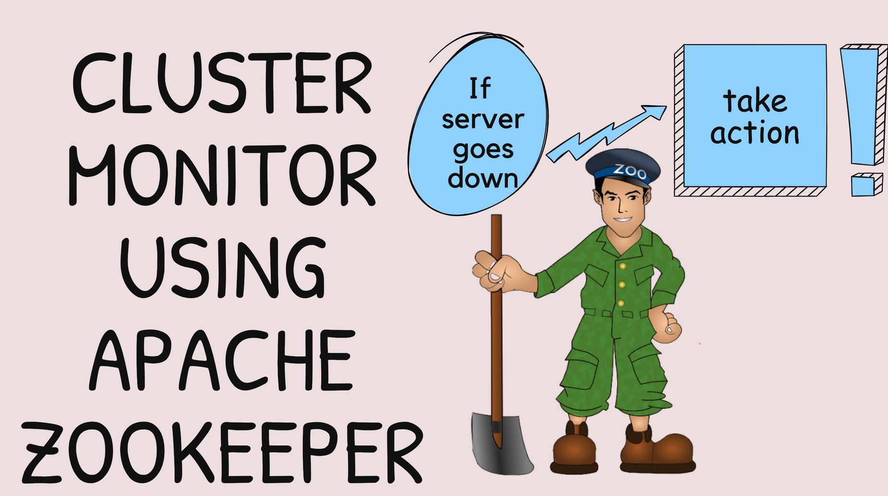

# Cluster monitoring using zookeeper 

### Prerequisite: 
Launch zookeeper server on local on port 2181  
Maven  
Java

### Local running steps: 

mvn exec:java -Dexec.mainClass=com.anubhav.ZookeeperMonitor
mvn exec:java -Dexec.mainClass=com.anubhav.ServersToBeMonitored

### screen shots
#### Plan

#### problem statement

#### problem with Polling 

#### Solution

