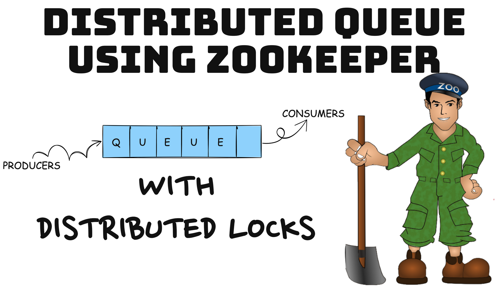
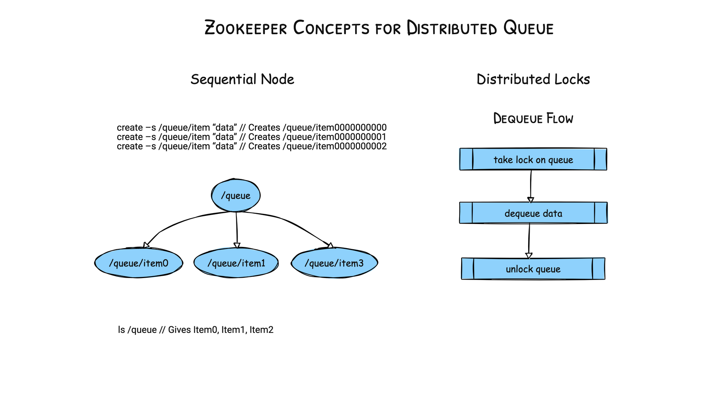

Run using:<br>
```
mvn exec:java -Dexec.mainClass=org.example.tester.Producer 
mvn exec:java -Dexec.mainClass=org.example.tester.Consumer -Dexec.args="Lock"
mvn exec:java -Dexec.mainClass=org.example.tester.Consumer -Dexec.args="NoLock"
```
You can run multiple instances of consumer

Here is the overview:





